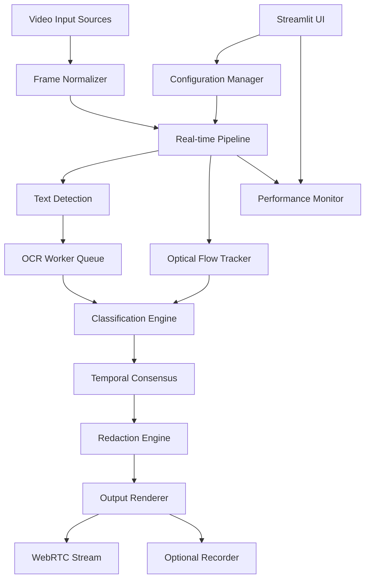

# Design Document

## Overview

Privacy-Redactor RT implements a real-time video processing pipeline that detects and redacts sensitive information from live video streams. The system uses a multi-threaded architecture with optimized frame processing, temporal tracking, and configurable redaction methods to achieve 30 FPS performance at 720p resolution on CPU-only hardware.

The core design principle is to minimize latency through intelligent frame skipping, optical flow propagation, and asynchronous OCR processing while maintaining high detection accuracy through temporal consensus and robust pattern matching.

## Architecture

### High-Level Architecture



### Processing Pipeline Flow

1. **Input Stage**: Video frames from webcam/RTSP/file are normalized to 1280×720 with letterboxing
2. **Detection Stage**: Text detection runs every N frames (default 3), with optical flow propagation on intermediate frames
3. **OCR Stage**: Asynchronous OCR processing with intelligent scheduling based on box movement and refresh intervals
4. **Classification Stage**: Pattern matching and validation for sensitive data categories
5. **Tracking Stage**: Temporal consensus and box smoothing to prevent flicker
6. **Redaction Stage**: Configurable blur/pixelate/solid methods applied per category
7. **Output Stage**: Rendered frames sent to WebRTC stream and optional recording

### Threading Model

- **Main Thread**: Streamlit UI and WebRTC frame processing
- **OCR Worker Thread**: Asynchronous text recognition with bounded queue
- **Recorder Thread**: Optional MP4 encoding via FFmpeg pipe
- **Performance Monitor Thread**: FPS and latency statistics collection

## Components and Interfaces

### Core Components

#### VideoTransformer (webrtc_utils.py)
```python
class VideoTransformer:
    def __init__(self, config: Config, pipeline: RealtimePipeline)
    def recv(self, frame: av.VideoFrame) -> av.VideoFrame
    def get_stats(self) -> Dict[str, float]
```

Responsibilities:
- WebRTC frame reception and conversion
- Pipeline orchestration per frame
- Performance statistics collection
- Backpressure management

#### RealtimePipeline (pipeline.py)
```python
class RealtimePipeline:
    def __init__(self, config: Config)
    def process_frame(self, frame: np.ndarray, frame_idx: int) -> np.ndarray
    def should_run_detection(self, frame_idx: int) -> bool
    def update_tracks(self, detections: List[Detection]) -> None
```

Responsibilities:
- Frame-by-frame processing coordination
- Detection scheduling logic
- Track management and lifecycle
- Temporal consensus enforcement

#### TextDetector (text_detect.py)
```python
class TextDetector:
    def __init__(self, config: DetectionConfig)
    def detect(self, frame: np.ndarray) -> List[BBox]
    def lazy_init(self) -> None
```

Responsibilities:
- PaddleOCR PP-OCRv4 text detection
- Lazy model initialization
- Bounding box extraction and filtering
- Confidence thresholding

#### OCRWorker (ocr.py)
```python
class OCRWorker:
    def __init__(self, config: OCRConfig, max_queue_size: int)
    def enqueue_roi(self, roi: np.ndarray, track_id: str) -> None
    def get_result(self, track_id: str) -> Optional[str]
    def start(self) -> None
    def stop(self) -> None
```

Responsibilities:
- Asynchronous OCR processing
- Queue management with backpressure
- Result caching per track ID
- Thread-safe operations

#### ClassificationEngine (classify.py)
```python
class ClassificationEngine:
    def __init__(self, config: ClassificationConfig)
    def classify_text(self, text: str) -> List[Match]
    def get_masked_preview(self, text: str, category: str) -> str
```

Responsibilities:
- Multi-category pattern matching
- Validation (Luhn, phonenumbers, entropy)
- Confidence scoring
- Privacy-preserving text masking

#### OpticalFlowTracker (track.py)
```python
class OpticalFlowTracker:
    def __init__(self, config: TrackingConfig)
    def propagate_tracks(self, frame: np.ndarray, prev_frame: np.ndarray) -> None
    def associate_detections(self, detections: List[Detection]) -> None
    def get_active_tracks(self) -> List[Track]
```

Responsibilities:
- Sparse optical flow calculation
- IoU-based track association
- Box coordinate smoothing
- Track lifecycle management

#### RedactionEngine (redact.py)
```python
class RedactionEngine:
    def __init__(self, config: RedactionConfig)
    def redact_regions(self, frame: np.ndarray, tracks: List[Track]) -> np.ndarray
    def apply_method(self, roi: np.ndarray, method: str) -> np.ndarray
```

Responsibilities:
- Multi-method redaction (gaussian, pixelate, solid)
- Per-category method selection
- Bounding box inflation
- Efficient in-place processing

### Data Models

#### Core Types (types.py)
```python
@dataclass
class BBox:
    x1: int
    y1: int
    x2: int
    y2: int
    confidence: float

@dataclass
class Detection:
    bbox: BBox
    text: Optional[str]
    timestamp: float

@dataclass
class Match:
    category: str
    confidence: float
    masked_text: str
    bbox: BBox

@dataclass
class Track:
    id: str
    bbox: BBox
    matches: List[Match]
    age: int
    hits: int
    last_ocr_frame: int
    flow_points: np.ndarray
```

### Configuration System

#### Pydantic Models (config.py)
```python
class IOConfig(BaseModel):
    target_width: int = 1280
    target_height: int = 720
    target_fps: int = 30
    letterbox: bool = True

class RealtimeConfig(BaseModel):
    detector_stride: int = 3
    ocr_refresh_stride: int = 10
    max_parallel_ocr: int = 1
    max_queue: int = 2

class DetectionConfig(BaseModel):
    min_text_confidence: float = 0.6
    bbox_inflate_px: int = 6
    min_box_size: Tuple[int, int] = (10, 10)

class ClassificationConfig(BaseModel):
    require_temporal_consensus: int = 2
    categories: List[str] = ["phone", "credit_card", "email", "address", "api_key"]
    entropy_threshold_bits_per_char: float = 3.5
```

## Data Models

### Detection Pipeline Data Flow

1. **Raw Frame** → **Normalized Frame** (1280×720 BGR)
2. **Normalized Frame** → **Text Regions** (List[BBox])
3. **Text Regions** → **OCR Results** (Dict[track_id, text])
4. **OCR Results** → **Classifications** (List[Match])
5. **Classifications** → **Tracked Matches** (List[Track])
6. **Tracked Matches** → **Redacted Frame** (np.ndarray)

### Temporal State Management

The system maintains several temporal data structures:

- **Active Tracks**: Current bounding boxes with associated metadata
- **OCR Cache**: Text results per track ID with timestamps
- **Flow Points**: Sparse feature points for optical flow calculation
- **Consensus Buffer**: Recent detections for temporal smoothing
- **Performance Metrics**: Rolling averages for FPS and latency

## Error Handling

### Graceful Degradation Strategy

1. **OCR Queue Full**: Skip OCR for current frame, use cached results
2. **Detection Failure**: Continue with optical flow propagation only
3. **Optical Flow Failure**: Fall back to previous frame's bounding boxes
4. **Classification Error**: Log error, skip classification for problematic text
5. **Redaction Failure**: Draw solid black rectangle as fallback

### Performance Monitoring

- **Frame Drop Detection**: Monitor queue depths and processing times
- **Latency Tracking**: End-to-end timing from input to output
- **Memory Management**: Automatic cleanup of expired tracks and cached data
- **Resource Limits**: CPU usage monitoring with automatic quality reduction

### Logging and Debugging

- **Structured Logging**: JSON format with configurable levels
- **Performance Metrics**: Real-time FPS, latency, and queue statistics
- **Detection Audit**: Optional JSONL logging with privacy-preserving previews
- **Error Tracking**: Categorized error counts with automatic recovery

## Testing Strategy

### Unit Testing

1. **Pattern Matching Tests**: Comprehensive regex validation for all categories
2. **Luhn Validation Tests**: Credit card number validation with edge cases
3. **Address Scoring Tests**: Rule-based address detection accuracy
4. **Optical Flow Tests**: Mock frame sequences with known transformations
5. **Redaction Tests**: Visual validation of blur/pixelate/solid methods

### Integration Testing

1. **Pipeline Tests**: End-to-end frame processing with mock inputs
2. **Performance Tests**: Latency and throughput validation under load
3. **WebRTC Tests**: Stream handling with various input formats
4. **Recording Tests**: MP4 output validation with audio preservation
5. **Configuration Tests**: YAML loading and validation

### Performance Testing

1. **Benchmark Suite**: Standardized test videos with known sensitive content
2. **Latency Profiling**: Per-component timing analysis
3. **Memory Profiling**: Memory usage patterns and leak detection
4. **Stress Testing**: Extended runtime with resource monitoring
5. **Hardware Validation**: Performance across different CPU configurations

### Visual Validation

1. **Detection Accuracy**: Manual review of detection quality on test videos
2. **Redaction Quality**: Visual inspection of blur effectiveness
3. **Temporal Stability**: Flicker detection and smoothness validation
4. **UI Responsiveness**: Streamlit interface performance testing
5. **Cross-Platform Testing**: Validation on different operating systems

## Implementation Considerations

### Performance Optimizations

1. **Model Caching**: Reuse PaddleOCR instances across frames
2. **Memory Pooling**: Pre-allocated arrays for common operations
3. **Vectorized Operations**: NumPy optimizations for image processing
4. **Lazy Loading**: Defer expensive initializations until needed
5. **Batch Processing**: Group OCR operations when possible

### Security Considerations

1. **Local Processing**: No network calls or external API dependencies
2. **Memory Clearing**: Explicit cleanup of sensitive data in memory
3. **Log Sanitization**: Automatic masking of all logged text content
4. **Input Validation**: Robust handling of malformed video inputs
5. **Resource Limits**: Protection against memory exhaustion attacks

### Scalability Considerations

1. **Modular Architecture**: Easy addition of new detection categories
2. **Plugin System**: Extensible redaction methods
3. **Configuration Flexibility**: Runtime parameter adjustment
4. **Hardware Adaptation**: Automatic quality scaling based on performance
5. **Future GPU Support**: Architecture ready for CUDA acceleration